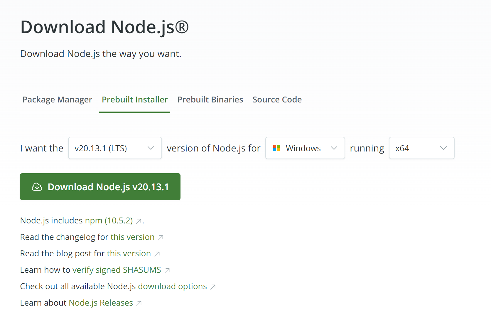

# React_implement

下載 nodejs：https://nodejs.org/en/download/prebuilt-installer




點選下載下來的 msi 安裝檔，並選擇自動安裝必要套件選項，就會自己跑


```cmd
npm init -y # 初始化 npm
npm install gh-pages # 安裝 gh-pages 套件
```

```
PS D:\使用者\Joseph Chen\Desktop\React_implement> node --version
v20.13.1
PS D:\使用者\Joseph Chen\Desktop\React_implement> npm --version
10.8.0
```
